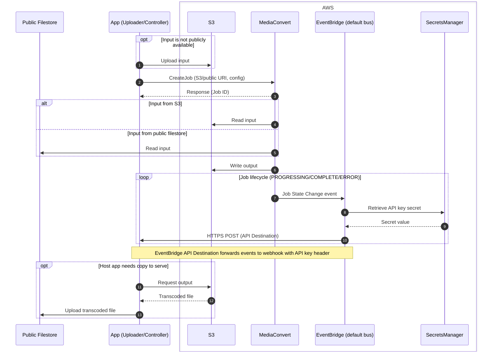

# AWS Elemental MediaConvert Transcoding Backend

This backend enables wagtailmedia to submit transcode jobs to AWS Elemental MediaConvert and receive asynchronous status updates via a webhook. It supports input from S3 or a public URL, and writes outputs to your configured media file store.

## Installation

This backend uses boto3 (minimum 1.40.43). Install via the optional extra:

```bash
pip install "wagtailmedia[boto3]"
```

We recommend using the most recent boto3 release supported by your environment.

## AWS Configuration

### Prerequisites

- An AWS account with access to the web console and permissions to create IAM roles/policies, MediaConvert jobs, EventBridge rules/API Destinations, Secrets Manager secrets, and S3 objects.
- An S3 bucket for output media, and potentially input media too.
- A public webhook endpoint URL (served by your host app) to receive job events.

### AWS Services Used

- MediaConvert: executes the transcode job.
- S3: optional input; required for output.
- EventBridge (default event bus): receives MediaConvert job state change events.
- EventBridge API Destination + Connection: forwards events to your public webhook and injects the API key from Secrets - Manager.
- Secrets Manager: stores the webhook API key.

> This guide documents only fields that affect integration, permissions, or security. Names and other cosmetic values (e.g., rule names/descriptions) are intentionally left to your preference.

This transcoding backend submits jobs to AWS Elemental MediaConvert (MediaConvert) and then receives HTTP POST callbacks with job status updates. The callback (webhook) is protected by a pre-configured API key sent in a request header.

We recommend, and provide configuration guidance for, configuring AWS EventBridge (EventBridge) to capture MediaConvert job events and using an EventBridge API Destination/Connection to POST to the public endpoint URL.



## Host Application Settings

You can use a number of methods to specify [credentials for boto3](https://boto3.amazonaws.com/v1/documentation/api/latest/guide/configuration.html). We suggest you stick with environment variables. To do that, you can set the following variables:

- AWS_ACCESS_KEY_ID
- AWS_SECRET_ACCESS_KEY
- AWS_DEFAULT_REGION

You must specify the name of the S3 bucket that should be used to store transcoded media using the following setting:

```python
AWS_STORAGE_BUCKET_NAME = os.environ.get("AWS_STORAGE_BUCKET_NAME", "")  # S3 bucket offline files are uploaded to and the transcoded files are stored in
```

## AWS (Manual) Setup

Using the AWS web console we can let AWS create some of the resources roles and policies for us. The steps below guide you through the manual setup so you keep tight control.

1. [Create the MediaConvert Service Policy](#create-the-mediaconvert-service-policy)
1. [Create the MediaConvert Service Role](#create-the-mediaconvert-service-role)
1. [Create the IAM user/group policy](#create-the-iam-usergrouprole-policy)
1. [Create the EventBridge Connection & API Destination](#create-the-eventbridge-connection--api-destination)
1. [Create the EventBridge rule](#create-the-eventbridge-rule)

Ensure you replace placeholder variables (`YOUR_BUCKET_NAME`, `ARNs`) to match your environment. If you use a custom role or ARN for the media convert role, expose it to your app via `AWS_MEDIACONVERT_ROLE_NAME`.

### Create the MediaConvert Service Policy

A policy is needed to allow read/write access to an S3 bucket. This policy will be made used to create a role for MediaConvert to assume in the next step.

From the AWS IAM dashboard create a new policy and use the JSON editor to copy the policy below:

```json
{
  "Version": "2012-10-17",
  "Statement": [
    {
      "Effect": "Allow",
      "Action": [
        "s3:Get*",
        "s3:List*"
      ],
      "Resource": [
        "arn:aws:s3:::YOUR_BUCKET_NAME/*"
      ]
    },
    {
      "Effect": "Allow",
      "Action": [
        "s3:Put*"
      ],
      "Resource": [
        "arn:aws:s3:::YOUR_BUCKET_NAME/*"
      ]
    }
  ]
}
```

### Create the MediaConvert Service Role

Now we create the service role MediaConvert will assume to allow it to read input from S3 and write outputs.

From the AWS IAM dashboard create a new role using a _Custom trust policy_ and copy the policy below:

```json
{
  "Version": "2012-10-17",
  "Statement": [
    {
      "Effect": "Allow",
      "Principal": { "Service": "mediaconvert.amazonaws.com" },
      "Action": "sts:AssumeRole"
    }
  ]
}
```

Attach the permission policy created in the [previous step](#create-the-mediaconvert-service-policy).

When naming the role it is strongly recommended to use the name `MediaConvert_Default_Role`. If you need to use a custom name, expose this to the app using the `AWS_MEDIACONVERT_ROLE_NAME` setting.

### Create the IAM user/group/role policy

These permissions are required for the IAM user, group, or role that will submit MediaConvert jobs and query their status.

You will need the Role ARN of your role in the [previous step](#create-the-mediaconvert-service-role). You can find this in the AWS console. It will look like:
`arn:aws:iam::YOUR_AWS_ACCOUNT_ID:role/service-role/MediaConvert_Default_Role.`

```json
{
  "Version": "2012-10-17",
  "Statement": [
    {
      "Sid": "AllowPassMediaConvertRoleToService",
      "Effect": "Allow",
      "Action": "iam:PassRole",
      "Resource": "YOUR_MEDIACONVERT_DEFAULT_ROLE_ARN",
      "Condition": {
        "StringEquals": {
          "iam:PassedToService": "mediaconvert.amazonaws.com"
        }
      }
    },
    {
      "Sid": "AllowMediaRoleRetrieval",
      "Effect": "Allow",
      "Action": "iam:GetRole",
      "Resource": "YOUR_MEDIACONVERT_DEFAULT_ROLE_ARN"
    },
    {
      "Sid": "AllowMediaConvertJobAndQueueManagement",
      "Effect": "Allow",
      "Action": [
        "mediaconvert:GetQueue",
        "mediaconvert:CreateJob"
      ],
      "Resource": "arn:aws:mediaconvert:YOUR_AWS_REGION:YOUR_AWS_ACCOUNT_ID:queues/Default"
    },
    {
      "Sid": "AllowS3UploadAndDownload",
      "Effect": "Allow",
      "Action": [
        "s3:PutObject",
        "s3:GetObject"
      ],
      "Resource": "arn:aws:s3:::YOUR_S3_BUCKET_NAME/*"
    }
  ]
}
```

If you target a custom queue, set the "Resource" for GetQueue to match your configuration.

### Create the EventBridge Connection & API Destination

EventBridge will forward MediaConvert job updates to your public webhook using an API key header.

From the EventBridge dashboard, select API destinations and Create API Destination and complete the form. This details below document only the setting required by the backend; names and other values are intentionally left to your preference:

- API destination endpoint - The public URL that will listen for the webhook, e.g. https://YOUR_HOSTNAME/media/webhooks/aws-transcoding/
- HTTP Method - POST
- Rate Limit (optional)
  - The default is 300 invocations per second
- Connection configuration > Create a new connection
- API type - Public
- Authorization type - API key
- API key name - X-API-Key
- Value
  - You should generate a secret key and enter it in this field, keep this key safe as you will need to expose it to the app later.
- Use an AWS owned key for connection encryption

### Create the EventBridge rule

EventBridge uses rules to capture specific events from a bus, here we configure a rule to capture MediaConvert job state change events.

From the EventBridge dashboard, select Rules and Create API Rule and complete the form. This details below document only the setting required by the backend; names and other values are intentionally left to your preference:

- Event bus - Default
- Enable rule on selected bus - Yes
- Rule with an event pattern - Yes

Next select to enter a custom pattern (JSON editor) and enter the policy below:

```json
{
  "source": ["aws.mediaconvert"],
  "detail-type": ["MediaConvert Job State Change"],
  "detail": {
    "status": ["PROGRESSING", "COMPLETE", "ERROR"]
  }
}
```

Next complete the remaining pages to create the rule using the following details:

- Target type - EventBridge API destination
- API destination - Use an existing API destination (the one created in the [previous step](#create-the-eventbridge-connection--api-destination))
- Execution role - Create a new role for this specific resource

## 4. Additional Notes

- Always use the full S3 ARN (e.g., `arn:aws:s3:::YOUR_BUCKET_NAME/*`) in policies, not S3 URLs.
- The `iam:PassRole` permission is required for the user or automation that submits jobs to MediaConvert.
- The MediaConvert service role must have a trust policy allowing `mediaconvert.amazonaws.com` to assume it.
