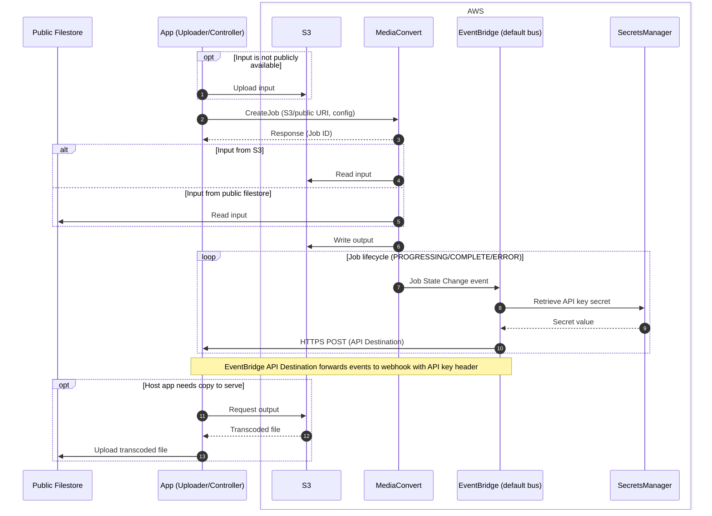

# AWS Elemental MediaConvert Transcoding Backend

This backend enables `wagtailmedia` to submit transcode jobs to AWS Elemental MediaConvert and receive asynchronous status updates via a webhook (AWS EventBridge). It supports input from S3 or a public URL, and writes output ready to be served from S3.

<details>
<summary>AWS Services Used</summary>

- MediaConvert: executes the transcode job.
- S3: optional input; required for output.
- EventBridge (default event bus): receives MediaConvert job state change events.
- EventBridge API Destination + Connection: forwards events to your public webhook and injects the API key from Secrets - Manager.
- Secrets Manager: stores the webhook API key.


```mermaid
sequenceDiagram
    autonumber

    participant WEB as Public Filestore
    participant APP as App (Uploader/Controller)

    box AWS
        participant S3 as S3
        participant EMC as MediaConvert
        participant EB as EventBridge (default bus)
        participant SM as SecretsManager
    end

    opt Input is not publicly available
        APP->>S3: Upload input
    end
    APP->>EMC: CreateJob (S3/public URI, config)
    EMC-->>APP: Response (Job ID)
    alt Input from S3
      EMC->>S3: Read input
    else Input from public filestore
      EMC->>WEB: Read input
    end

    EMC->>S3: Write output

    loop Job lifecycle (PROGRESSING/COMPLETE/ERROR)
        EMC->>EB: Job State Change event
        EB->>SM:  Retrieve API key secret
        SM-->>EB: Secret value
        EB->>APP: HTTPS POST (API Destination)
    end

    Note over EB,APP: EventBridge API Destination forwards events to webhook with API key header

    opt Host app needs copy to serve
        APP->>S3: Request output
        S3-->>APP: Transcoded file
        APP->>WEB: Upload transcoded file
    end

```

</details>

## Prerequisites

- An AWS account with access to the web console and permissions to create IAM roles/policies, MediaConvert jobs, EventBridge rules/API Destinations, and S3 objects.
- An IAM user, used to authenticate to AWS (using an access key) and assign policies to.
- An S3 bucket for output media, and potentially input media too.
- The public domain name your application will use when hosted (to allow webhooks to be received from AWS EventBridge), or a publicly-accessible URL for local testing.

## Installation

### boto3

> [!IMPORTANT]
> Install and configure the `wagtailmedia` package before configuring a transcoding backend (see [README](../../README.md)).

This backend requires the `boto3` package (minimum version 1.40.43). Install via the optional extra:

```bash
pip install "wagtailmedia[boto3]"
```

### Required settings

#### Transcoding backend

Add the AWS MediaConvert backend to your `wagtailmedia` settings:

```python
# settings.py

WAGTAILMEDIA = {
    "TRANSCODING_BACKEND": "wagtailmedia.transcoding_backends.aws.EMCTranscodingBackend",
}
```

#### AWS credentials

You can use a number of methods to specify [credentials for boto3](https://boto3.amazonaws.com/v1/documentation/api/latest/guide/configuration.html). We suggest you stick with environment variables. To do that, you can set the following variables in your environment:

- AWS_ACCESS_KEY_ID
- AWS_SECRET_ACCESS_KEY

#### S3 bucket name

You must specify the name of the S3 bucket that should be used to store transcoded media by adding the following setting:

```python
# settings.py

AWS_STORAGE_BUCKET_NAME = os.environ.get("AWS_STORAGE_BUCKET_NAME", "")  # S3 bucket for storing input files (if not publicly accessible) and transcoded outputs
```

Then set the following environment variable:

- `AWS_STORAGE_BUCKET_NAME`

#### Webhook API key

The webhook requests will be verified using an API key which needs to be exposed to the app. Add the following setting:

```python
# settings.py

AWS_WEBHOOK_API_KEY = os.environ.get("AWS_WEBHOOK_API_KEY", "")
```

The API key is created in a [later](#create-the-eventbridge-connection--api-destination) section of the readme.

#### URL configuration

Your project needs to be set up to receive webhooks for EventBridge when hosted. This can be enabled by adding the following snippet to `urls.py`:

```python
from django.urls import path, include

urlpatterns = [
    # ... the rest of your URLconf goes here ...
    path('media/webhooks/', include('wagtailmedia.urls')),
]
```

This will make the webhook available at: /media/webhooks/aws-transcoding/

## AWS infrastructure setup

Using the AWS web console we can let AWS create some of the resources roles and policies for us. The steps below guide you through the manual setup so you keep tight control.

> [!NOTE]
> This guide documents only fields that affect integration, permissions, or security. Names and other cosmetic values (for example, rule names and descriptions) are intentionally left to your preference.

1. [Create the MediaConvert Service Policy](#create-the-mediaconvert-service-policy)
1. [Create the MediaConvert Service Role](#create-the-mediaconvert-service-role)
1. [Create the IAM user policy](#create-the-iam-user-policy)
1. [Create the EventBridge Connection & API Destination](#create-the-eventbridge-connection--api-destination)
1. [Create the EventBridge rule](#create-the-eventbridge-rule)

Ensure you replace placeholder variables (for example `YOUR_S3_BUCKET_NAME`, `ARNs`) to match your environment.

### Create the MediaConvert Service Policy

A policy is needed to allow read/write access to an S3 bucket. This policy will be used to create a role for MediaConvert to assume in the next step.

From the AWS IAM dashboard create a new policy and use the JSON editor to copy the policy below, replacing the bucket name placeholder with your S3 bucket name:

```json
{
  "Version": "2012-10-17",
  "Statement": [
    {
      "Effect": "Allow",
      "Action": [
        "s3:Get*",
        "s3:List*"
      ],
      "Resource": [
        "arn:aws:s3:::YOUR_S3_BUCKET_NAME/*"
      ]
    },
    {
      "Effect": "Allow",
      "Action": [
        "s3:Put*"
      ],
      "Resource": [
        "arn:aws:s3:::YOUR_S3_BUCKET_NAME/*"
      ]
    }
  ]
}
```

### Create the MediaConvert Service Role

Now we create the service role MediaConvert will assume to allow it to read input from S3 and write outputs.

From the AWS IAM dashboard create a new role using a _Custom trust policy_ and copy the policy below:

```json
{
  "Version": "2012-10-17",
  "Statement": [
    {
      "Effect": "Allow",
      "Principal": { "Service": "mediaconvert.amazonaws.com" },
      "Action": "sts:AssumeRole"
    }
  ]
}
```

Attach the permission policy created in the [previous step](#create-the-mediaconvert-service-policy).

When naming the role it is strongly recommended to use the name `MediaConvert_Default_Role` as the MediaConvert service uses it by default when you create jobs in the future. If you use a different naming convention, expose this to the app by adding the following setting in your host applications settings file:

```python
AWS_MEDIACONVERT_ROLE_NAME = os.environ.get("AWS_MEDIACONVERT_ROLE_NAME")
```

Then set the following environment variable:

- `AWS_MEDIACONVERT_ROLE_NAME`

### Create the IAM user policy

These permissions are required for the IAM user that will submit MediaConvert jobs and query their status.

You will need the Role ARN of your role from the [previous step](#create-the-mediaconvert-service-role). You can find this in the AWS console. It will look like:
`arn:aws:iam::YOUR_AWS_ACCOUNT_ID:role/MediaConvert_Default_Role.`

From the AWS IAM dashboard create a new policy and use the JSON editor to copy the policy below, replacing the placeholders with your details:

```json
{
  "Version": "2012-10-17",
  "Statement": [
    {
      "Sid": "AllowPassMediaConvertRoleToService",
      "Effect": "Allow",
      "Action": "iam:PassRole",
      "Resource": "YOUR_MEDIACONVERT_DEFAULT_ROLE_ARN",
      "Condition": {
        "StringEquals": {
          "iam:PassedToService": "mediaconvert.amazonaws.com"
        }
      }
    },
    {
      "Sid": "AllowMediaRoleRetrieval",
      "Effect": "Allow",
      "Action": "iam:GetRole",
      "Resource": "YOUR_MEDIACONVERT_DEFAULT_ROLE_ARN"
    },
    {
      "Sid": "AllowMediaConvertJobAndQueueManagement",
      "Effect": "Allow",
      "Action": [
        "mediaconvert:GetQueue",
        "mediaconvert:CreateJob"
      ],
      "Resource": "arn:aws:mediaconvert:YOUR_AWS_REGION:YOUR_AWS_ACCOUNT_ID:queues/Default"
    },
    {
      "Sid": "AllowS3UploadAndDownload",
      "Effect": "Allow",
      "Action": [
        "s3:PutObject",
        "s3:GetObject"
      ],
      "Resource": "arn:aws:s3:::YOUR_S3_BUCKET_NAME/*"
    }
  ]
}
```

MediaConvert allows you to create custom queues to manage the resources that are available to your account, to process multiple jobs concurrently, and to change prioritisation. If you are using a queue other than the `Default`, the queue name needs to be exposed to the app by adding the following setting in your host applications settings file:

```python
AWS_MEDIACONVERT_QUEUE_NAME = os.environ.get("AWS_MEDIACONVERT_QUEUE_NAME")
```

Then the following environment variable:

- `AWS_MEDIACONVERT_QUEUE_NAME`

Finally, change the `Default` queue name in the policy to use your custom queue name:

```json
{
  "Version": "2012-10-17",
  "Statement": [
    ...
    {
      "Sid": "AllowMediaConvertJobAndQueueManagement",
        ...
      "Resource": "arn:aws:mediaconvert:YOUR_AWS_REGION:YOUR_AWS_ACCOUNT_ID:queues/AWS_MEDIACONVERT_QUEUE_NAME"
    }
    ...
  ]
}
```

Add this policy to the IAM user that will be used to connect to AWS.

### Create the EventBridge Connection & API Destination

EventBridge will forward MediaConvert job updates to your public webhook, with the request origin being validated using a shared API key in the header of the webhook.

From the EventBridge dashboard, select API destinations and Create API Destination and complete the form. The details below document only the settings required by the backend; names and other values are intentionally left to your preference:

- API destination endpoint - The public URL that will listen for the webhook, e.g. https://YOUR_HOSTNAME/media/webhooks/aws-transcoding/
- HTTP Method - POST
- Rate Limit (optional)
  - The default is 300 invocations per second
- Connection configuration > Create a new connection
- API type - Public
- Authorization type - API key
- API key name - X-API-Key
- Value
  - You should generate a secret key and enter it in this field, keep this key safe as you will need to expose it to the app later.
- Use an AWS owned key

Ensure the `AWS_WEBHOOK_API_KEY` environment variable is set with the same value you entered in the API key configuration above.

### Create the EventBridge rule

EventBridge uses rules to capture specific events from a bus, here we configure a rule to capture MediaConvert job state change events.

From the EventBridge dashboard, select Rules and Create a rule. The details below document only the settings required by the backend; names and other values are intentionally left to your preference:

1. Define rule detail
   - Event bus - default
   - Enable the rule on the selected event bus - Yes
   - Rule type - Rule with an event pattern

2. Build event pattern
   - Event source - Other
   - Creation method - Custom pattern (JSON editor), and enter the policy below:

      ```json
      {
        "source": ["aws.mediaconvert"],
        "detail-type": ["MediaConvert Job State Change"],
        "detail": {
          "queue": ["arn:aws:mediaconvert:YOUR_AWS_REGION:YOUR_AWS_ACCOUNT_ID:queues/Default"],
          "status": ["PROGRESSING", "COMPLETE", "ERROR"]
        }
      }
      ```

   > [!NOTE]
   > If using a custom queue name, replace `Default` with your queue name.

3. Select target(s)
   - Target types - EventBridge API destination
   - API destination - Use an existing API destination, select the API destination you created [previously](#create-the-eventbridge-connection--api-destination)
   - Execution role - Create a new role for this specific resource

### Additional Notes

- Always use the full S3 ARN (e.g., `arn:aws:s3:::YOUR_S3_BUCKET_NAME/*`) in policies, not S3 URLs.
- The `iam:PassRole` permission is required for the user or automation that submits jobs to MediaConvert.
- The MediaConvert service role must have a trust policy allowing `mediaconvert.amazonaws.com` to assume it.
